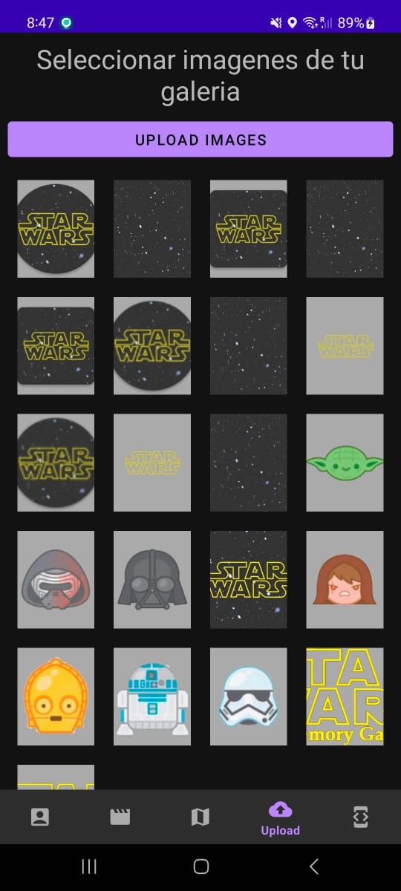

# Challenge Android Developer

Este proyecto encontrarás que fue creado con las siguientes tecnologías:

| Tecnología | Descripción |
| ------ | ------ |
| Kotlin | Lenguaje de programación para Android|
| MVVM | Patrón de arquitectura MVVM |
| Dagger Hilt | Inyección de Dependencias |
| Navigation | Navigation Component |
| View Binding | Vinculación de vista |
| Clean Architecture | Arquitectura |
| Google Maps | Mapas |
| ManagePermissions | Tools Custom |
| Firebase | Firestore - Storage |
| GPS Location | Coordenadas |
| Retrofit y Corrutinas | Consumir y procesar  API |
| Fuente de datos | [The Movie DB](https://www.themoviedb.org/documentation/api) |

# Aplicación Prueba

[Download APK](https://github.com/ILara-wd/challenge-android-developer/blob/feature/firebase_storage/apk/app-challenge.apk)

# Screenshot App

|  |  |  |  |  |
| ---------------------------------------------- | -------------------------------------------- | ------------------------------------------- | ------------------------------------------- | ------------------------------------------- |

# Screenshot Console Firebase

 

> Mejoras a Considerar
* Storage MVVM - Hilt - Update UI
* Agregar Room para mostrar offline
* Profile -The Movie DB-
* About Me
